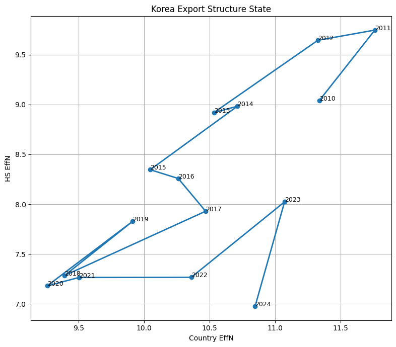
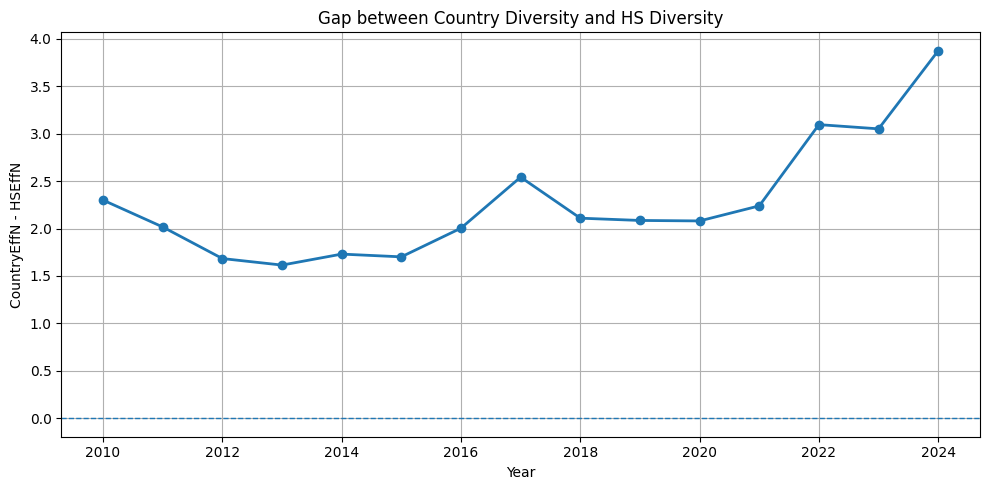
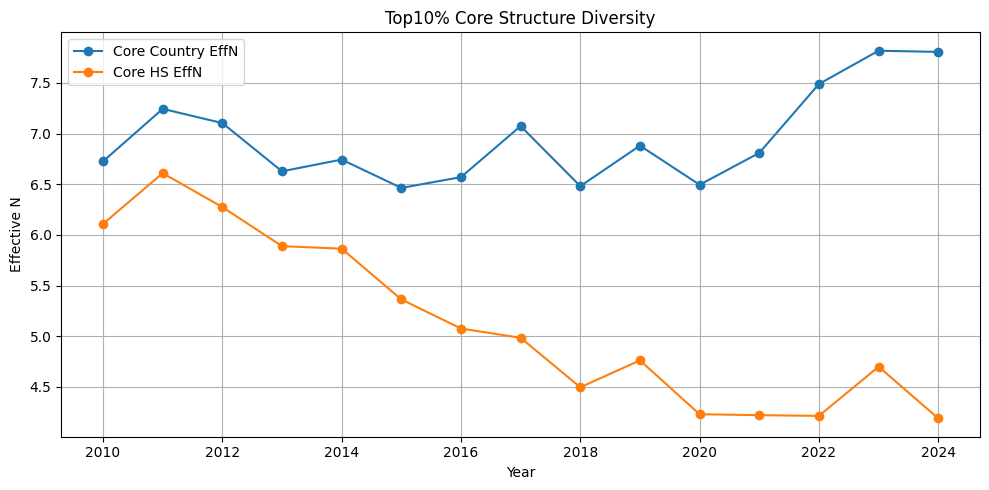
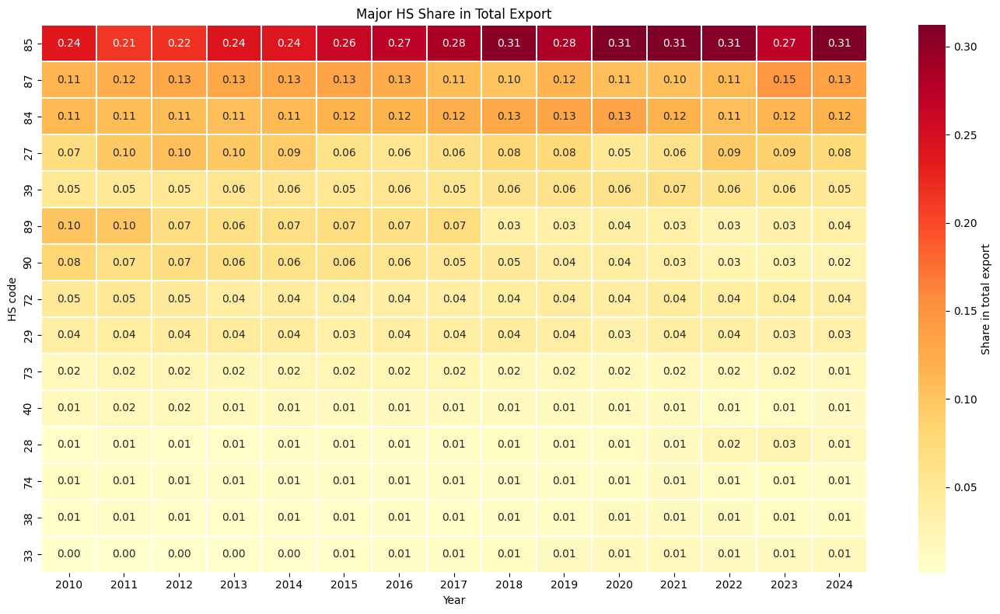
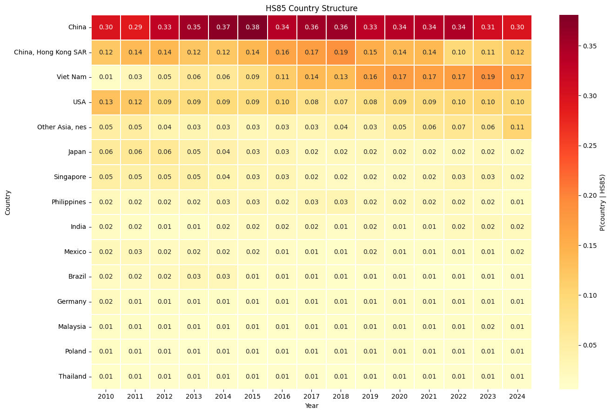

# ESD (Emergent Structure Dynamics)
## Trade Structure Analysis using Scale and Effective Diversity

K.D. Pom   
**Date:** 2026-05-26  
**DOI:** [10.5281/zenodo.20389082](http://doi.org/10.5281/zenodo.20389082)

ESD (Emergent Structure Dynamics) is a framework for transforming trade data into a dynamic state-space representation.

Instead of focusing only on export magnitude, ESD describes an economic system through:

- Scale
- Structural diversity
- Temporal movement

The framework converts trade tables into state vectors and observes how systems evolve through time.

---

# Motivation

Traditional trade analysis typically focuses on:

- total export value
- growth rate
- market share
- trade balance

These metrics explain magnitude but often ignore structural evolution.

For example:

Two countries may have equal export volume:

Country A:

- exports evenly across many countries
- exports many products

Country B:

- exports mainly one product
- exports mainly one market

Total export values may be identical, but their structures differ significantly.

ESD aims to capture this hidden structural information.

---

# Data

Source:

- UN Comtrade

Example dataset:

- Korea export
- 2010–2024
- HS2 level

Input variables:

| Variable | Description |
|--|--|
| refYear | Year |
| partnerDesc | Export partner |
| cmdCode | HS code |
| primaryValue | Export value |

---

# State Definition

ESD transforms trade data into a dynamic state vector representation.

For a given year \(t\):

$$
\mathbf{S}_t
=
(
L1_t,
EffN_{country,t},
EffN_{HS,t}
)
$$

where:

| Variable | Meaning |
|--|--|
| \(L1_t\) | Total export scale |
| \(EffN_{country,t}\) | Effective number of export destinations |
| \(EffN_{HS,t}\) | Effective number of export products |

Interpretation:

- \(L1\) captures economic scale
- \(EffN_{country}\) captures market diversity
- \(EffN_{HS}\) captures product diversity

---

# Scale Definition

Scale is defined as:

$$
L1_t
=
\sum_i x_i
$$

where:

- \(x_i\) = export value

Interpretation:

- larger value → larger economic activity

---

# Diversity Definition

Structural diversity is measured using HHI:

$$
HHI
=
\frac{
\sum_i x_i^2
}{
(\sum_i x_i)^2
}
$$

Effective Number:

$$
EffN
=
\frac{1}{HHI}
$$

Interpretation:

- High EffN

    evenly distributed structure

- Low EffN

    concentrated structure

---

# Dynamic State Space

A sequence of yearly state vectors creates a trajectory:

$$
\mathbf{S}_1
\rightarrow
\mathbf{S}_2
\rightarrow
...
\rightarrow
\mathbf{S}_n
$$

Distance between states:

$$
D_t
=
||
\hat{\mathbf{S}}_t
-
\hat{\mathbf{S}}_{t-1}
||
$$

where:

$$
\hat{\mathbf{S}}
$$

is a normalized state vector.

Interpretation:

- Direction indicates structural change
- Distance indicates magnitude of change
- Small movement → stable structure
- Large movement → structural transition or external shock

Examples:

Higher:

$$
EffN_{country}
$$

→ broader export markets

Lower:

$$
EffN_{HS}
$$

→ increasing product concentration

---

# Korea Case Study (2010–2024)

The framework was applied to Korea export data.

Analysis procedure:

1. Download UN Comtrade data

2. Aggregate yearly export tables

3. Calculate:

- total scale (\(L1\))
- country diversity (\(EffN_{country}\))
- product diversity (\(EffN_{HS}\))

4. Construct state trajectories

5. Analyze structural evolution

---

# Results

## Export state trajectory

Observation:

- Early years show relatively high product diversity
- Later years show decreasing product diversity
- Country diversity remains relatively stable

---

## Diversity gap

Defined as:

$$
Gap
=
EffN_{country}
-
EffN_{HS}
$$

Observation:

Gap increases over time.

Interpretation:

Korea exports to many countries, but through fewer dominant products.

---

## Core structure (Top 10%)

Observation:

Core product diversity decreases continuously.

---

## Major product concentration

Observation:

HS85 becomes increasingly dominant.

---

## HS85 partner structure

Observation:

Production networks gradually shift toward broader Asian supply chains.

---

# Framework Insights

1. Scale and diversity are independent dimensions.

2. Country diversity and product diversity evolve differently.

3. Structural concentration can increase even when total trade grows.

4. State trajectories reveal hidden structural transitions.

---

# Future Work

Potential extensions:

- Wasserstein trajectory distance
- Density fields (KDE)
- Energy interpretation
- State transition probabilities
- ESD latent dynamics

---

# Data Sources and References

### UN Comtrade

United Nations Comtrade Database

- Main database:
  https://comtrade.un.org/

- API documentation:
  https://comtradedeveloper.un.org/

### Country Mapping

R package: comtradr

Reference:

https://docs.ropensci.org/comtradr/reference/country_codes.html

---

### Data Access

Trade data can be programmatically queried through:

- Python API
- R `comtradr` package
- bulk download services

